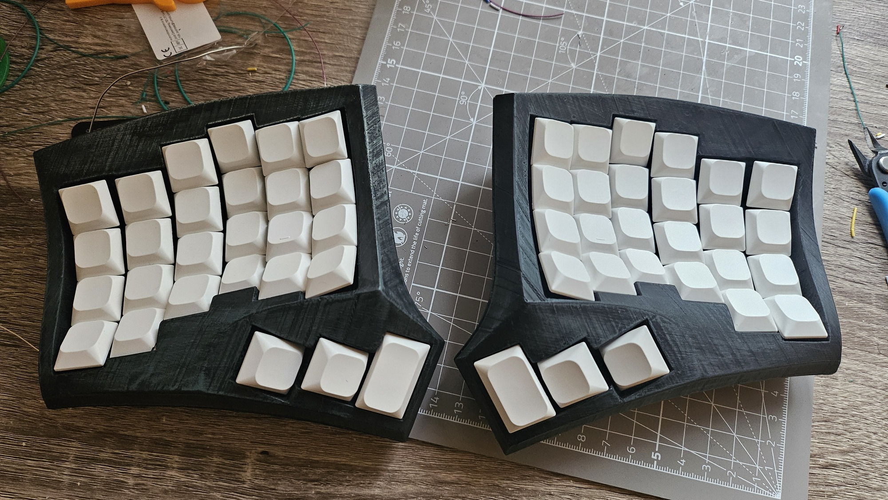

Some fun stuff I've worked on.

# Tiger Compiler

Educational compiler written in C++ for the
[Tiger](https://www.cs.princeton.edu/~appel/modern/) language. More context in
the [teaching](teaching.md#tiger-compiler) section.

I started working on Tiger as a maintainer when I was still a student in 2020
and worked on improving the instruction selection process by switching from a
custom code generator ([`monoburg`](https://gitlab.lre.epita.fr/tiger/monoburg))
to native C++ "pattern-matching" using `std::variant`s and `std::visit`. I'd
call that a mixed result: deprecating `monoburg` was a success and meant we
had one less project to maintain, but trying to match dynamic patterns with
static variants meant that composite patterns were impossible and the matching
process is very clunky and can result in error messages thousands of lines long
(thank C++ templates)[^tc1]. Back then, I was expecting that pattern-matching
would eventually show up in a C++ version update[^tc2], but I guess that's not
happening any time soon so a student is currently working on rewriting this
without `std::variant`s.

[^tc1]: I talked about it in detail in my talk at the [*Nuit de l'Info
2021*](https://www.youtube.com/watch?v=THGk7lFHgNQ) (in French).

[^tc2]: How young and naive I was! [We're not even modules yet](https://arewemodulesyet.org)...

Another topic I experimented with back then was adding support for functional
programming through closure conversion. The main part of the codebase was
not to be touched so I tried to leave the middle-end alone and resolve almost
everything in the front-end through a large desugaring pass (similar to what
we actually do with objects). I somehow managed to get it to work, although the
result was not pretty, and ended up being left aside due to bikeshedding on the
syntax for calls to function pointers[^tc3].

[^tc3]: [Wadler's Law](https://wiki.haskell.org/Wadler%27s_Law) truly is inevitable.

Nowadays, my work mostly revolves around helping the new students maintainer
take their marks, reviewing their work, and deciding the direction the project
takes.

# Keyboards

Not technically programming, but close enough. I use split
minimalist keyboards and they're a lot of fun, especially using
[combos](https://zmk.dev/docs/keymaps/combos).

I've had a GBoards
[gergoplex](https://kowodo.github.io/HardwareTools/gergoPlex.html) since 2021
and it's great. It was cheap enough to get it delivered directly built from
Canada and I haven't had any issue with it since I got it. It even survived a
catastrophic incident involving a spilled coffee cup over its bare PCB, somehow.
GBoards seem to have closed shop, which is a shame because their keyboards were
great.

My other main keyboard is a 4x6 [Dactyl
Cygnus](https://github.com/juhakaup/keyboards/tree/main/Cygnus%20v1.0) from Juha
Kauppinen which I handbuilt in late 2024.

I wanted to have a keyboard for home which I could use both for work and gaming,
so I figured I'd need a number row and dedicated tab/shift/control keys. After
days (and nights) of 3D printing the case and a couple days of soldering, I'm
quite satisfied of the end result. If I were to do it again I'd probably only
do one half in 4x6 and the other in 3x5 as I don't use most of the "extra"[^kb1] keys
on the right hand side.

[^kb1]: Meaning, only 18 out of 27 keys.

# This site

Technically a project I guess. Built with from Markdown using `pandoc`, `sed`,
`make` and some duct tape. It's not much but it's mine -- and way simpler than
any static code generator I could find.

Thanks to this
[post](https://localghost.dev/blog/this-page-is-under-construction/) for giving
enough motivation to get started, and [these](http://lukasschwab.me/blog/)
[blogs](https://www.sacredheartsc.com/blog/makefile-based-blogging/) for
inspiration on building this using pandoc.

[Source code](https://github.com/maelcravero/maelcravero.github.io).
